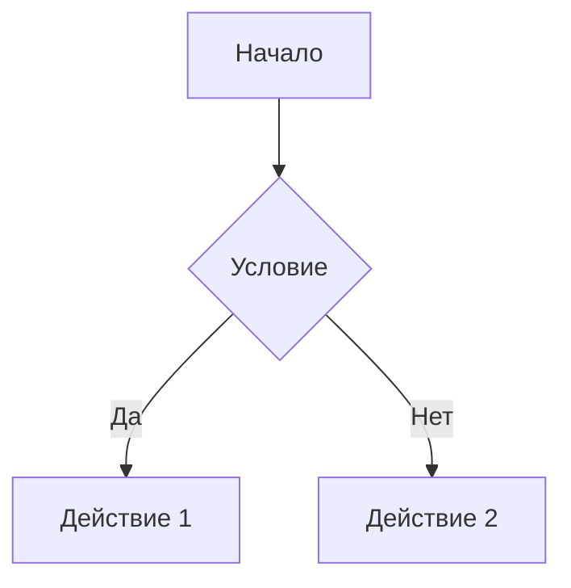

# Примеры использования современного форматтера для Telegram

## Установка зависимостей

```bash
pip install -r requirements.txt
```

## Основные возможности

### 1. Автоматическая конвертация Markdown

```python
from modern_telegram_formatter import convert_markdown_to_telegram

# Простой Markdown
text = """
# Заголовок
**Жирный текст** и *курсив*
`код` и ~~зачеркнутый~~
||спойлер||
"""

# Автоматический выбор лучшего формата
formatted_text, parse_mode = convert_markdown_to_telegram(text, "auto")

# Принудительное использование HTML
formatted_text, parse_mode = convert_markdown_to_telegram(text, "html")

# Принудительное использование MarkdownV2
formatted_text, parse_mode = convert_markdown_to_telegram(text, "markdown_v2")
```

### 2. Отправка сообщений с автоматическим форматированием

```python
from main import send_formatted_message

# Автоматический выбор формата
await send_formatted_message(bot, chat_id, text, "auto")

# Принудительное использование HTML
await send_formatted_message(bot, chat_id, text, "html")

# Принудительное использование MarkdownV2
await send_formatted_message(bot, chat_id, text, "markdown_v2")
```

### 3. Очистка текста для Telegram

```python
from modern_telegram_formatter import clean_text_for_telegram_modern

# Очистка от HTML и Markdown разметки
cleaned_text = clean_text_for_telegram_modern(text)
```

## Примеры форматирования

### Базовое форматирование

```python
text = """
**Жирный текст**
*Курсив*
__Подчеркнутый__
~~Зачеркнутый~~
`Инлайн код`
```Блок кода```
||Спойлер||
"""

# Результат в HTML:
# <b>Жирный текст</b>
# <i>Курсив</i>
# <u>Подчеркнутый</u>
# <s>Зачеркнутый</s>
# <code>Инлайн код</code>
# <pre><code>Блок кода</code></pre>
# <tg-spoiler>Спойлер</tg-spoiler>
```

### Расширяемые цитаты

```python
text = """
**> Подробное объяснение

> Это расширяемая цитата, которая будет
> скрыта по умолчанию в Telegram
> Пользователь может развернуть её кликом
"""

# Результат: специальный формат для Telegram с возможностью разворачивания
```

### Таблицы и сложные элементы

```python
text = """
| Колонка 1 | Колонка 2 | Колонка 3 |
|------------|------------|------------|
| Данные 1   | Данные 2   | Данные 3   |


"""

# Автоматически конвертируется в HTML для лучшей поддержки
```

## Обработка ошибок

### Fallback на базовые функции

```python
try:
    # Попытка использовать современный форматтер
    formatted_text, parse_mode = convert_markdown_to_telegram(text, "auto")
except Exception as e:
    logging.error(f"Ошибка современного форматтера: {e}")
    
    # Fallback на базовые функции
    formatted_text = escape_markdown_v2(text)
    parse_mode = "MarkdownV2"
```

### Проверка доступности библиотек

```python
from modern_telegram_formatter import TELEGRAMIFY_AVAILABLE

if TELEGRAMIFY_AVAILABLE:
    print("telegramify-markdown доступен")
else:
    print("telegramify-markdown не установлен")
```

## Интеграция с существующим кодом

### Обновление функции отправки уведомлений

```python
# Старый код
async def send_notifications(bot: Bot, repo_name: str, release: Dict) -> int:
    message = format_release_message(repo_name, release)
    # ... отправка сообщения

# Новый код с современным форматтером
async def send_notifications(bot: Bot, repo_name: str, release: Dict) -> int:
    message = format_release_message(repo_name, release)
    
    # Используем современный форматтер
    success = await send_formatted_message(
        bot=bot,
        chat_id=CHANNEL_ID,
        text=message,
        target_format="auto"
    )
    
    return 1 if success else 0
```

### Обновление команд бота

```python
@dp.message(Command("help"))
async def help_command(message: Message):
    help_text = """
**Доступные команды:**

/start - Запуск бота
/help - Показать эту справку
/filter - Настройка фильтров
/last - Последние релизы
/stats - Статистика бота
/donate - Поддержать проект

||**Секретная информация:**
Бот автоматически форматирует все сообщения
для лучшего отображения в Telegram||
"""
    
    # Используем современный форматтер
    success = await send_formatted_message(
        bot=message.bot,
        chat_id=message.chat.id,
        text=help_text,
        target_format="auto"
    )
    
    if not success:
        # Fallback на старый способ
        await message.answer(help_text)
```

## Настройка и кастомизация

### Настройка telegramify-markdown

```python
from modern_telegram_formatter import formatter

# Настройка параметров
formatter.setup_telegramify()

# Доступные настройки:
# customize.strict_markdown = False  # Разрешить __underline__
# customize.cite_expandable = True   # Включить расширяемые цитаты
# customize.underline = True         # Поддержка подчеркивания
# customize.spoiler = True           # Поддержка спойлеров
```

### Создание собственного форматтера

```python
from modern_telegram_formatter import ModernTelegramFormatter

class CustomFormatter(ModernTelegramFormatter):
    def __init__(self):
        super().__init__()
        # Дополнительная настройка
        
    def custom_format(self, text: str) -> str:
        # Собственная логика форматирования
        return text
```

## Лучшие практики

### 1. Всегда используйте "auto" для автоматического выбора формата

```python
# Хорошо
formatted_text, parse_mode = convert_markdown_to_telegram(text, "auto")

# Плохо (может привести к ошибкам)
formatted_text, parse_mode = convert_markdown_to_telegram(text, "markdown_v2")
```

### 2. Обрабатывайте ошибки и используйте fallback

```python
try:
    result = await send_formatted_message(bot, chat_id, text, "auto")
except Exception as e:
    logging.error(f"Ошибка форматирования: {e}")
    # Fallback на простую отправку
    await bot.send_message(chat_id, text)
```

### 3. Используйте спойлеры для скрытия информации

```python
text = """
Основная информация видна всем.

||**Секретная информация:**
Это будет скрыто до клика пользователя||
"""
```

### 4. Используйте расширяемые цитаты для длинных объяснений

```python
text = """
**> Подробное объяснение

> Каждая строка должна начинаться с ">"
> Это создаст расширяемую цитату в Telegram
> Пользователь сможет развернуть её при необходимости
"""
```

## Отладка и логирование

### Включение подробного логирования

```python
import logging

# Настройка логирования для форматтера
logging.basicConfig(level=logging.DEBUG)
logger = logging.getLogger('modern_telegram_formatter')
logger.setLevel(logging.DEBUG)
```

### Проверка результатов конвертации

```python
# Проверка валидности MarkdownV2
from modern_telegram_formatter import formatter

text = "Текст с **форматированием**"
formatted_text, parse_mode = convert_markdown_to_telegram(text, "markdown_v2")

if parse_mode == "MarkdownV2":
    is_valid = formatter._validate_markdown_v2(formatted_text)
    print(f"MarkdownV2 валиден: {is_valid}")
```

## Производительность

### Кэширование результатов

```python
from functools import lru_cache

@lru_cache(maxsize=1000)
def cached_format(text: str, target_format: str = "auto"):
    return convert_markdown_to_telegram(text, target_format)
```

### Асинхронная обработка

```python
import asyncio

async def format_multiple_texts(texts: list[str]):
    tasks = []
    for text in texts:
        task = asyncio.create_task(
            convert_markdown_to_telegram(text, "auto")
        )
        tasks.append(task)
    
    results = await asyncio.gather(*tasks, return_exceptions=True)
    return results
```
